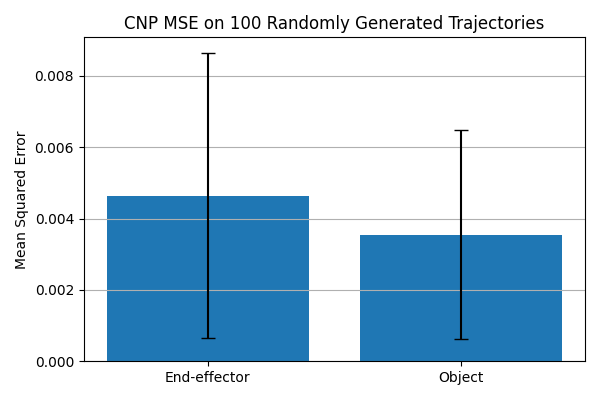

# README

This repository implements a **Conditional Neural Process (CNP)** to predict a robot arm’s end‑effector and object positions from a few observed points.

---

## Model Architecture

- **Inputs (query & condition):**

  - `t` (normalized time ∈ [0,1])
  - `h` (object height)  
    → total **2** dimensions.

- **Outputs (targets):**

  - `e_y, e_z` (end‑effector y/z)
  - `o_y, o_z` (object y/z)  
    → total **4** dimensions.

- **Encoder:** MLP that embeds each context point `(t, h, e_y, e_z, o_y, o_z)` into a 128‑D hidden vector.
- **Aggregation:** Mean‑pooling across context embeddings to get a fixed 128‑D summary.
- **Decoder:** MLP that takes the summary + each query `(t,h)` and outputs both:
  - **mean** (4‑D)
  - **log‑std** (4‑D) → converted via `softplus` + `min_std` to a positive σ.
- **Loss:** Negative log‑likelihood under a Normal distribution `(mean, σ)` for the target dimensions.

---

## Data Collection & Training

### Data Collection

1. Use `Hw5Env` (MuJoCo) to generate **1,000** trajectories along random Bézier curves in the y‑z plane.
2. Record high‑level state `(e_y, e_z, o_y, o_z, h)` at **100** steps per trajectory.
3. Prepend normalized time `t` → each point is `(t, e_y, e_z, o_y, o_z, h)`.

### Batch Preparation (`prepare_batch`)

- For each mini‑batch entry, pick one trajectory and randomly sample:
  - `n_context ∈ [1, T/2]`
  - `n_target  ∈ [1, T − n_context]`
- Context points provide full `(t,h,ey,ez,oy,oz)`; targets only provide `(t,h)` to predict the rest.

### Training

- **Model:** hidden size 128, 3 hidden layers, `min_std = 0.1`.
- **Optimizer:** Adam, `lr = 1e-3`.
- **Epochs:** 500, **Batch size:** 4.
- Prints NLL loss every 50 epochs.

---

## Evaluation

### Single‑Trajectory Visualization

- From one held‑out trajectory, randomly select **5** target points and use the rest as context.
- Plot predicted mean ±1 σ vs. ground truth for each of `e_y, e_z, o_y, o_z` in 4 subplots.

### 100 Random Tests

1. Generate **100** fresh trajectories.
2. For each:
   - Randomly choose `n_context ∈ [1, T/2]`, `n_target ∈ [1, T−n_context]`.
   - Predict targets and compute MSE separately for end‑effector `(e_y,e_z)` vs. object `(o_y,o_z)`.
   - Save per‑test scatter plots in `results/test_{i}.png`.
3. Aggregate MSE across tests and plot mean ± std in a bar chart:
   - **End‑effector MSE** ≈ 0.0046
   - **Object MSE** ≈ 0.0035

---

## Results & Insights

- The model captures the general trend of the end‑effector trajectory with moderate accuracy.
- Small object displacements are predicted within the uncertainty bands.
- End‑effector errors exhibit higher variance due to more complex motion patterns when the object falls.

---

_All plots and logs are saved under the `results/` directory._
